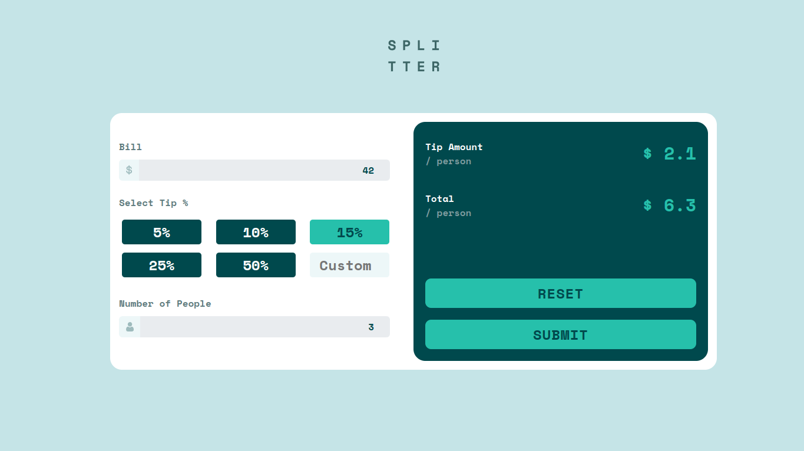
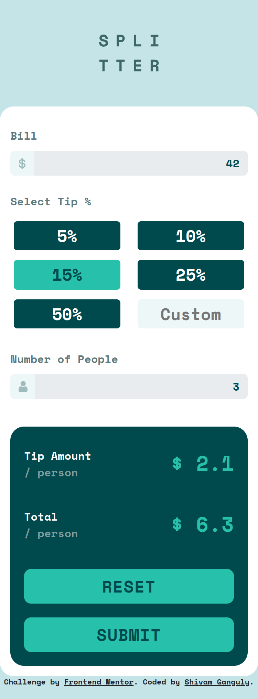

# Frontend Mentor - Tip calculator app solution

This is a solution to the [Tip calculator app challenge on Frontend Mentor](https://www.frontendmentor.io/challenges/tip-calculator-app-ugJNGbJUX). Frontend Mentor challenges help you improve your coding skills by building realistic projects.

## Table of contents

- [Overview](#overview)
  - [The challenge](#the-challenge)
  - [Screenshot](#screenshot)
  - [Links](#links)
- [My process](#my-process)
  - [Built with](#built-with)
  - [What I learned](#what-i-learned)
  - [Continued development](#continued-development)
- [Author](#author)
- [Acknowledgments](#acknowledgments)

## Overview

### The challenge

Users should be able to:

- View the optimal layout for the app depending on their device's screen size
- See hover states for all interactive elements on the page
- Calculate the correct tip and total cost of the bill per person

### Screenshot

### Links

- Solution URL: [Github](https://github.com/MonarchRyuzaki/Tip-Calculator-App)
- Live Site URL: [Live Here !!](https://monarchryuzaki.github.io/Tip-Calculator-App)

## My process

### Built with

* Semantic HTML5 markup
* Utilization of CSS custom properties
* Responsive design achieved through Flexbox
* Adhering to a mobile-first workflow
* DOM manipulation for dynamic content

### What I learned

During the development of this project, I acquired valuable insights and skills, including:

* Understanding and styling input groups as cohesive units when selected
* Efficient management of a large number of elements
* Enhanced proficiency in positioning elements within the layout
* In-depth experience with DOM manipulation techniques
* Continued practice and learning in the realm of frontend development

### Continued development

Moving forward, my focus is on:

* Gaining more experience with advanced DOM manipulation
* Exploring and working with APIs to broaden my skill set

## Author

* LinkedIn - [Shivam Ganguly](https://www.linkedin.com/in/shivam-ganguly-357b90255/)
* Frontend Mentor - [@MonarchRyuzaki](https://www.frontendmentor.io/profile/MonarchRyuzaki)

## Acknowledgments

Special thanks to Colt Steele for his inspiring Web Development Bootcamp, which provided valuable insights and guidance throughout the learning process.
